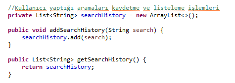

##### emlakcepte uygulamasına aşağıdaki yeni özellikleri ekleyin. 
- Şehir ve ilçe bazlı ilan arama.


- Kullanıcı yaptığı aramaları kaydedebilmeli, listeleyebilmeli.


- Bireysel kullanıcılar sadece Konut tipinde ve en fazla 3 ilan yayınlayabilirler.


- Şehir vitrini 10 ilandan oluşur. Şehir bazlı vitrinler oluşturun.
```
// Şehir vitrinlerini oluşturma
Map<String, List<Realty>> cityRealtyMap = new HashMap<>();
cityRealtyMap.put("Istanbul", new ArrayList<>());
cityRealtyMap.put("Ankara", new ArrayList<>());
cityRealtyMap.put("Izmir", new ArrayList<>());

// Vitrinlere ilanları ekleme
for (Realty realty : realtyService.getAllRealties()) {
  String city = realty.getProvince();
  if (cityRealtyMap.containsKey(city)) {
    cityRealtyMap.get(city).add(realty);
  }
}
```

- İstanbul, Ankara, İzmir şehirlerindeki ilanlarının sayısını bulun.
```
// İstanbul, Ankara, İzmir şehirlerindeki ilanların sayısı
int istanbulRealtyCount = cityRealtyMap.get("Istanbul").size();
int ankaraRealtyCount = cityRealtyMap.get("Ankara").size();
int izmirRealtyCount = cityRealtyMap.get("Izmir").size();
```

- İstanbul, Ankara, İzmir şehirlerindeki satılık konut ilanlarının sayısını bulun.
```
// İstanbul, Ankara, İzmir şehirlerindeki satılık konut ilanlarının sayısı
int istanbulSaleRealtyCount = 0;
int ankaraSaleRealtyCount = 0;
int izmirSaleRealtyCount = 0;

for (Realty realty : cityRealtyMap.get("Istanbul")) {
  if (realty.getType() == RealtyType.SALE) {
    istanbulSaleRealtyCount++;
  }
}
for (Realty realty : cityRealtyMap.get("Ankara")) {
  if (realty.getType() == RealtyType.SALE) {
    ankaraSaleRealtyCount++;
  }
}
for (Realty realty : cityRealtyMap.get("Izmir")) {
  if (realty.getType() == RealtyType.SALE) {
    izmirSaleRealtyCount++;
  }
}
```